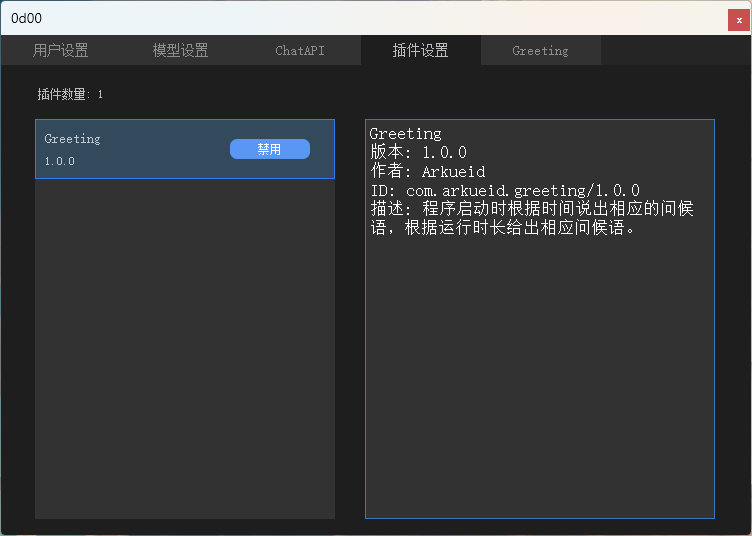
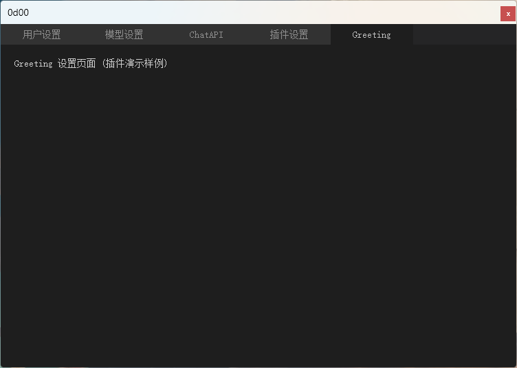
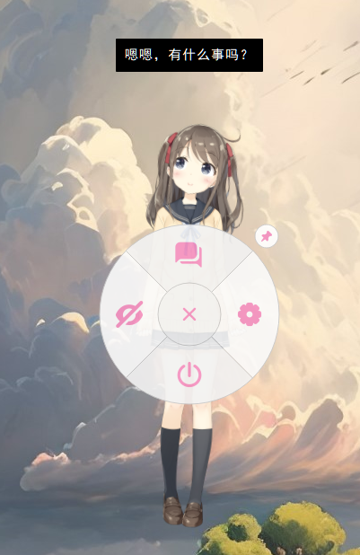
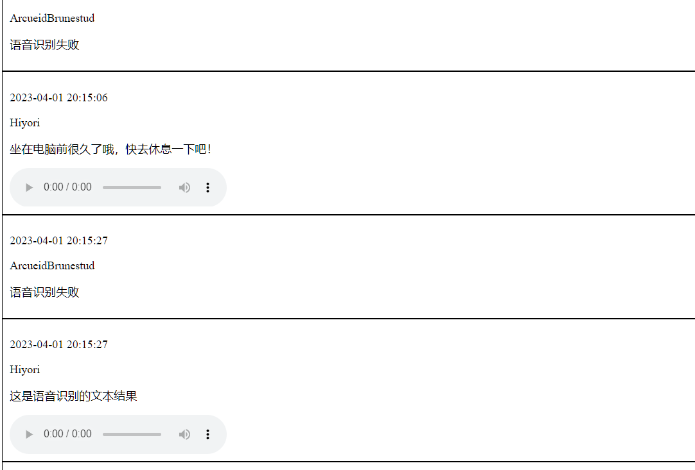
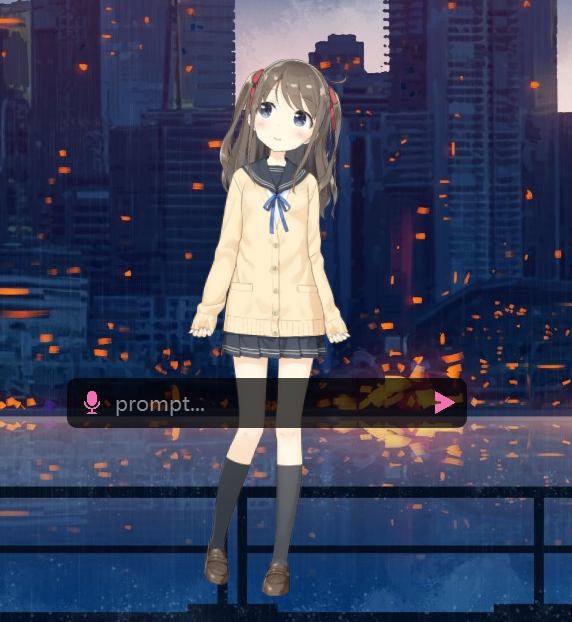
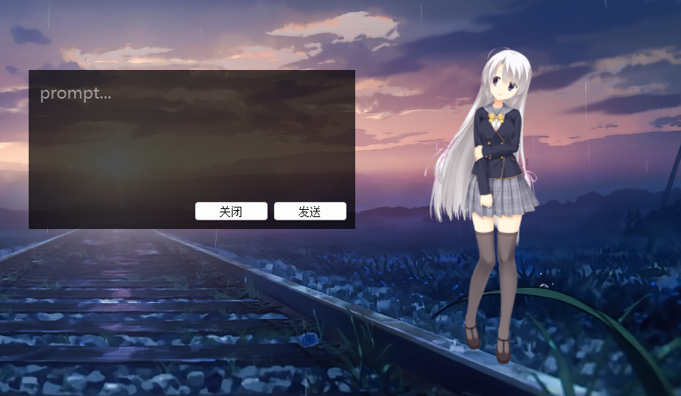

# Changelog

### 2023-08-31
***add***  
Hitokoto 插件，每隔 5s 播放一言中的文本（独立计时，有动作播放时停止计时），数据来自 [hitokoto-osc/sentences-bundle](https://github.com/hitokoto-osc/sentences-bundle)

***fix***  
1. 动作的结束判断现在以音频、文本、动画三者全部播放完毕为判断标准。动作播放间隔相应从动作完全播放完毕时为起点开始计时。
2. 禁用多个插件时相应的设置页面无法关闭。
3. 启用 Greeting 插件后程序无法正常退出。

### 2023-08-25
***add***  

1. 插件生命周期  

	```cpp
	class IPlugin
	{
	public:
		~IPlugin() = default;

		virtual void Activate() = 0;  // 关闭插件时调用

		virtual void Deactivate() = 0;  // 开启插件时调用

		virtual void Initialize(ILApp* app) = 0;  // 插件示例化后，初次使用前应该先初始化

		virtual void OnLaunch() = 0;  // 程序启动时调用

		virtual void OnScheduledTask() = 0;  // 周期性任务，每帧调用一次

		virtual void OnShutdown() = 0;  // 程序关闭时调用
	};
	```
2. 插件状态管理  

	插件开启状态保存在 config.json 中:  

	```json
	"Plugins" : 
	{
		"com.arkueid.greeting/1.0.0" : true
	},
	```
	
### 2023-08-12
***add***
* 插件系统
	* 可以依照给出的接口类编写 ***QT插件***，编译为动态库 ***.dll**，放在桌宠目录下的 plugins 中，即可被扫描读取 (目前没有设计安全检测，详细见 ***develop*** 分支的 ***Greeting*** 插件样例)  
	
		```
		live2d-x86.exe
		live2d-x86-debug.exe
		plugins
			|----Greeting
			|		|----Greeting.dll
			|
			|----Plugin2
			|		|----Plugin2.dll
			|		|----customResourceDir // 插件所需的资源文件夹
			|		|----Dir2
			|		...
			|
			|----Plugin3
			...
		```

		插件可以实现在 ***托盘右键菜单*** 和 ***设置窗口*** 添加 ***选项*** / ***页面***，可以添加自定义的窗口和自定义功能（自定义功能后续会逐步拆解原项目实现更灵活的操作）

		

		

		

***fix***
* 修复系统默认编码为 GBK 时加载包含中文的路径导致程序崩溃和 debug 输出乱码。现在在Windows 区域设置是否中勾选 Unicode UTF-8 不会对中文路径造成影响。
* 修复首次加载聊天功能时由于没有 chat 文件夹导致 sqlite 数据库文件创建报错。 

### 2023-08-09
***change***
* 现在可以从聊天记录中复制聊天内容

***fix***
* 聊天时角色的回答动作会被 Idle 动作组的动作打断

### 2023-08-08
***changes***
* 设置窗口使用 Material 风格，组件来自：https://github.com/laserpants/qt-material-widgets

***fix***
* 修复模式的开启与关闭无法保存
* 源码改为 UTF-8 后导致含中文路径的模型资源加载崩溃，打开设置页面崩溃(v0.3.5 存在该问题)

### 2023-08-07
***changes***
* 聊天记录使用 sqlite 储存
* 重新启动应用会加载当天的所有聊天记录
* 聊天记录现在可以以天为单位在历史记录窗口查询
* 拆分 UI 资源和模型资源文件夹，现在 UI 资源固定放置在 assets 文件夹下
* 源代码由 GBK 更改为 UTF-8
* 自定义文本聊天和语音聊天统一用 json 格式进行传输，请求类型为 POST，参见[自定义聊天服务器模板](dev-server/dev-server.py)

***add***
* 添加随机播放内置文本，数据源一言：https://github.com/hitokoto-osc/sentences-bundle

***fix***
* 历史记录中播放音频无效
* 自定义语音聊天开启后再次启动程序开启无效

### 2023-08-05
***change***
* 优化所有窗口的拖动功能，现在不会出现窗口抖动
* 取消聊天历史靠边隐藏
* 所有窗口统一左键拖动
* 左键双击调出聊天输入框
* 暂时取消对话框的字体颜色和背景颜色的设置

***add***
* 添加环形菜单，菜单组件来自：https://github.com/SimonBuxx/piemenu-qt


### 2023-07-14
* 移除鸡肋的番剧列表功能
* 用回之前的鼠标追踪
* 修复角色移到桌面左边缘图像消失的问题

### 2023-05-31
* 微调UI
* 系统托盘中的设置选项现在不需要退出才保存
* 近期停更

### 2023-4-30
* 增加模型设置  
	* 增加角色X，Y坐标设置
    	* 参数范围：-1.00~1.00 (精度最高2位小数)
    	* 坐标(0, 0)为窗口中心坐标，即对应屏幕坐标(windowWidth/2, windowHeight/2)
	* 对于[#14](https://github.com/Arkueid/Live2DMascot/issues/14)中提及的类似模型，可以通过调整窗口大小和角色X、Y来达到最佳显示位置

* 已知问题：  
  1. [#12](https://github.com/Arkueid/Live2DMascot/issues/12)
  2. [#14](https://github.com/Arkueid/Live2DMascot/issues/14)的截图中出现了类似[#12](https://github.com/Arkueid/Live2DMascot/issues/12)的问题，同时角色嘴唇附近出现黑边，详细参考下方链接： 
    	* https://docs.live2d.com/zh-CHS/cubism-sdk-manual/texture-trouble-shooting/
    	* https://tieba.baidu.com/p/6029180797  
	* 问题解释
    	* 问题1、2可能是同一原因导致
    	* 由于在Live2D Viewer中测试可以正常显示，因此不太可能是设备适配问题，可能与纹理图片的正片叠底有关？
	* 问题解决
    	* 目前只有问题2得到解决，问题1由于在我的设备上没遇到过不能确定是否解决，如果问题2和问题1是同一原因导致那么本次更新将解决[#12](https://github.com/Arkueid/Live2DMascot/issues/12)
		* 运行效果
		* 

### 2023-4-28
#### develop分支
* 修改项目生成中间文件路径，现在更换Console和Window配置不需要全部重新编译
* 修改静态库生成目录，现在生成的所有静态库在对应项目（x64或x86）的lib文件夹下
* 同一个Demo项目共用Framework，glew，glfw的中间生成目录
#### master分支
* 修改鼠标追踪，应该所有改动中是效果最好的

### 2023-4-26
* 添加分支develop，用于保存工程项目

### 2023-4-4
Fix:  
* 修复[#11](https://github.com/Arkueid/Live2DMascot/issues/11)
* 角色在屏幕边缘鼠标追踪不正常

### 2023-4-2
* 修改鼠标追踪的坐标计算，使角色视线在对角线附近变化平缓
* 修复聊天时角色对话框一段时间后不消失的的问题

### 2023-4-1
* 语音输入
	* 频繁点击录音按钮现在不会造成崩溃  

	* 添加自定义语音聊天接口，详细见test-server的[模板](test-server/server.py)  

	* 录音文件是.wav格式，采样率16000，单声道，其他参数需要自行测试

* 聊天记录
	* 添加聊天记录窗口，支持语音播放，仅显示本次运行的所有聊天，下次启动会清空

		

		
	
	* 聊天记录窗口和输入窗口可以拖住边缘移动，聊天记录窗口支持屏幕侧边隐藏

	* 本地聊天记录改为html格式，记录时间，角色名，聊天内容，语音路径（可播放），浏览器打开如下：  

		

* 关于自定义

	* 聊天输入面板的三个图标是可以更换的，在Resources文件夹下把自己的图标改成对应名称即可

	* 有一部分样式在config.json中可以自定义

### 2023-3-26
* 语音输入
	* 录音和绘图放在不同线程，不会造成卡顿
	* 不要在短时间内多次点击录音按钮
	* 长按**语音输入按钮**或者激活输入窗口后按**alt键**进行录音
	* 目前使用百度语音识别 [api](https://ai.baidu.com/ai-doc/SPEECH/Vk38lxily#raw-%E6%96%B9%E5%BC%8F%E4%B8%8A%E4%BC%A0%E9%9F%B3%E9%A2%91)，client_id 和 client_secret 可以在 config.json 中更换

		

### 2023-3-25
* 语音输入
	* 目前使用百度语音识别 [api](https://ai.baidu.com/ai-doc/SPEECH/Vk38lxily#raw-%E6%96%B9%E5%BC%8F%E4%B8%8A%E4%BC%A0%E9%9F%B3%E9%A2%91)，client_id 和 client_secret 可以在 config.json 中更换
	* 长按**语音输入按钮**或者激活输入窗口后按**alt键**进行录音
	* 后续会添加自定义 POST 录音数据到自建服务端
	* 开始录音时界面会卡顿，卡顿时间看设备性能，原因是启动录音的函数和图形界面放在了一个线程里。不另开线程的原因是使用QAudioInput录音时，创建的实例不在主线程，输出的音频文件为空，暂时没有找到解决的方法，后续会考虑其他录音接口。

### 2023-3-21
* 输入框调整

	  


### 2023-3-16
* 聊天输入窗口可右键按住边缘拖动；窗口添加发送和关闭按钮，点击发送不会自动关闭窗口；config.json中可修改部分样式属性  

	  

* 文本框自动换行优化，句末标点不会出现在行首
* 已知问题：  
频繁启动和退出可能弹出资源路径不正确的提示，该问题与<io.h>的_access函数有关，具体原因暂时不清楚

### 2023-3-15
* 音量控制
	* 使用 waveOutSetVolume api 控制输出音量

	* 开启后会检测模型的动作文件参数是否正确，如果不正确会对参数进行修正并保存。此功能用于应对[#5](https://github.com/Arkueid/Live2DMascot/issues/5)。开启后可能增加模型加载时间，修复模式下加载的模型，第二次加载可以不需要开启修复模式。

### 先前更新
* 修复  
	* Win64下设置页面打开导致程序崩溃
	* 程序启动失败的问题  

		**可能原因1**  

		启动时获取当前系统用户名的代码运行错误，现已删除获取当前系统用户名，默认用户名固定为UserXXXX。  

		

		**已确认原因2**  

		Dialog初始化时未给_fontMetrics变量赋值，程序启动时分配的初始值不为NULL，在LoadConfig函数中导致用delete释放了一个未被分配的内存。<del>哼哼哼啊啊啊(#>д<)ﾉ</del>

		  


	* 番剧列表初次加载频闪问题（第二次修复） 
	* 网络请求模块无网络时导致程序崩溃 (第二次修复)