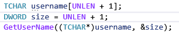
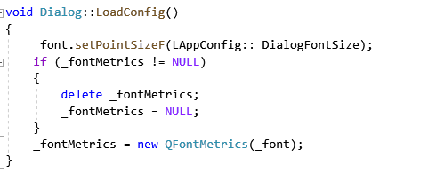

# Changelog

### 2023-3-15
* 音量控制
	* 使用 waveOutSetVolume api 控制输出音量
	* 预置模型 Hiyori 的全部语音和 nn 的部分语音是通过 AGCTTS 生成的，降低音量可能会导致杂音或者截断
* 修复模式
	* 开启后会检测模型的动作文件参数是否正确，如果不正确会对参数进行修正并保存。此功能用于应对[#5](https://github.com/Arkueid/Live2DMascot/issues/5)。开启后可能增加模型加载时间，修复模式下加载的模型，第二次加载可以不需要开启修复模式。

### 先前更新
* 修复  
	* Win64下设置页面打开导致程序崩溃
	* 程序启动失败的问题  

		**可能原因1**  

		启动时获取当前系统用户名的代码运行错误，现已删除获取当前系统用户名，默认用户名固定为UserXXXX。  

		

		**已确认原因2**  

		Dialog初始化时未给_fontMetrics变量赋值，程序启动时分配的初始值不为NULL，在LoadConfig函数中导致用delete释放了一个未被分配的内存。<del>哼哼哼啊啊啊(#>д<)ﾉ</del>

		  

	* 番剧列表初次加载频闪问题（第二次修复） 
	* 网络请求模块无网络时导致程序崩溃 (第二次修复)