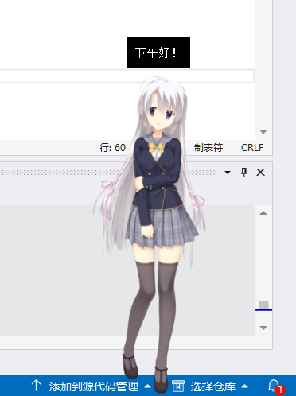
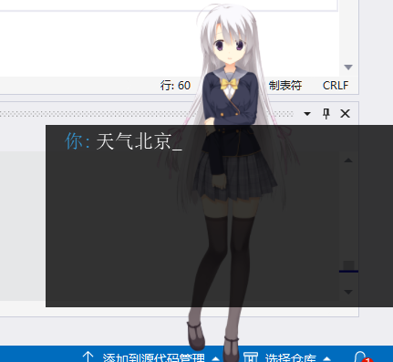
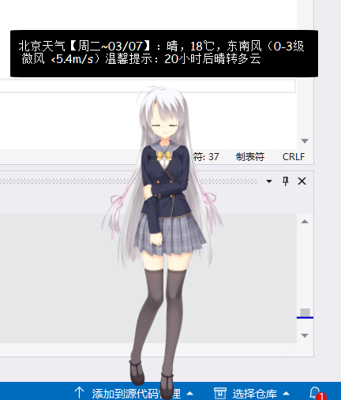

# Live2D Desktop Mascot
### Language: **[中文](README.md)** | **English**  
***
## Contents

1. [Software Security](#security-warning)
2. [Preview](#preview)
3. [Features](#features)  
	* [Interface for custom chat-waifu-like server](#custom-chat-server-api-editable-in-settings#)
	* [Custom motion groups](#custom-motion-groups-and-binding-hit-areas)
	* [Daily bangumi list](#bangumi-list)
	* [Holiday tips](#holiday-tip)
	* [Rightmenu & System trayicon](#system-tray-icon--right-menu)
	* [Setting widget](#setting-widget)
	* [Sound](#playing-sound)
	* [Text for sound](#text-display)  
4. [Notice](#notice)
5. [Dev-Environment](#developing-environment)
6. [Compiling](#compile)  

## Preview    

  

  

 

# Security Warning

As is mentioned in [Live2D: Security Tranwreck](https://undeleted.ronsor.com/zh-cn/live2d-a-security-trainwreck/), it may be **unsafe** to load untrusted live2d models using programs that based on Cubism SDK Core. So be cautious about using models that are untrusted or downloaded from suspicious websites through Live2d Mascot .  

# Features 

* ### Custom Chat Server Api (Editable in settings)
  
	**Request from Live2D Mascot**  
	```http
	GET /chat?Text=YourInputText HTTP/1.1
	Accept-Charset: UTF-8
	User-Agent: DesktopLive2D/v0.1.1
	```

	**Response from server**

	**- Headers**
	```json
	{

		"Text": "Nice to meet you, too.",  //Text response from server
		"...": "..."  //no restrictions to other params
	} 
	```

	**- Body**
	```
	bytes of XXX.wav  //audio files, nullable
	```

* ### Configuration

	* Edit in Settings  


		

	* Edit in config.json

	```json

		"ChatAPI" : 
		{
			"ChatSavePath" : "chat",  //path where text and sound files are saved
			"CustomChatServer" : 
			{
				"HostPort" : "http://127.0.0.1:50721",  //Server address, both http and https is ok
				"On" : true,  //turn on custom chat server
				"ReadTimeOut" : 10,  //maximum time (second) for waiting response 
				"Route" : "/chat"  //server route
			},
		}
	
	```

	Custom Server Sample：

	```python
	@app.route("/chat", methods=["GET"])
	def chat():
		# receiving text param from client response
		text = request.args.get("Text", "")
		print("Text: %s" % text)

		# make response
		rsp = make_response()

		# add param "Text"
		rsp.headers.add_header("Text", "Remeber to have a rest after a long time of sitting".encode("utf-8"))
		
		# write .wav bytes in response body
		with open("serverFiles\\nn.longsittingtip_0.wav", "rb") as f:
			rsp.set_data(f.read())
		return rsp
	```

	Motions in motion group **Chat** will be played when get response from custom chat server or Mlyai.

	Notice that each chat msg will generate text files and .wav files.  

* ### **Custom Motion Groups and Binding Hit Areas**  


  Reference: https://github.com/murcherful/Live2D_Displyer

  Here are the quotaions: 
  - 设置触发区域和相应动作组
  - 首先要了解`model3.json`中有关动作和触发区域的设定，以及文件的结构
    - 文件的结构大致为，模型文件可能不包含`Groups`和`HitAreas`，如果没有，请安以下规则填写，`Group`可无
      ```json
      {
      	"Version":3,
      	"FileReferences": {...},
      	"Groups": [...],
      	"HitAreas": [...]
      }
      ```
    - `FileReferences`的结构
      ```json
      "FileReferences": {
      	"Moc": ...,
      	"Textures": [...],
      	"Motions": {...},
      	...
      }
      ```
    - `Motions`的结构为，`path`为`yyy.motion3.json`与`xxx.model3.json`的相对路径
      ```json
      "Motions": {
      	"Idle":[
      		{"File": "path", "FeedINTime": 0.5, "FeedOutTime": 0.5},
      		{"File": "path", "FeedINTime": 0.5, "FeedOutTime": 0.5},
      		...
      	],
      	"TapBody":[
      		{"File": "path", "FeedINTime": 0.5, "FeedOutTime": 0.5},
      		{"File": "path", "FeedINTime": 0.5, "FeedOutTime": 0.5},
      		...
      	],
      	"TapArea1":[
      		{"File": "path", "FeedINTime": 0.5, "FeedOutTime": 0.5},
      		{"File": "path", "FeedINTime": 0.5, "FeedOutTime": 0.5},
      		...
      	],
      	...
      }
      ```
      `Motions`下的分组，比如`Idle`，`TapBody`，`TapArea1`等，表示鼠标点击至相应区域会触发的动作组，触发时，会随机一个动作组中的动作。注意，程序定义的分组标识有
      ```
      Idle
      TapBody
      TapArea1
      TapArea2
      TapArea3
      TapArea4
      TapArea5
      TapArea6
      TapArea7
      TapArea8
      TapArea9
      ```
      其中`Idle`为空闲时的动作组，其他为触发相应区域的动作组
    - `HitAreas`的结构为
      ```json
      "HitAreas": [
      	{"Name": "Body", "Id":"id"},
      	{"Name": "Area1", "Id":"id"},
      	{"Name": "Area2", "Id":"id"},
      	...
      ]
      ```
      其中`Name`为指定的区域名，程序定义的区域名有
      ```
      Body
      Area1
      Area2
      Area3
      Area4
      Area5
      Area6
      Area7
      Area8
      Area9
      ```
      这些区域与动作组的名称像对应
  - 了解了文件结构，想要设置相应的动作，首先要定义触发区域。而定义触发区域首先要知道模型区域的名字。这时：
    - 下载Live2D Cubsim3 Viewer，见[百度贴吧帖子](https://tieba.baidu.com/p/6066105365?red_tag=2138000797)或去[官网](https://www.live2d.com/download/cubism/)（注意直接下载**Cubism Editor**，不是**Cubism Viewer for Unity**）下载，下载安装后自动有Viewer，这个是免费的
    - 打开Viewer，将模型打开
    - 点击左上角的`xxx.moc3`，左下角出现信息
    - 将信息顶端的`Parameter`替换为`ArtMesh`
    - 点击相应的`ID`可以看见相应的区域变蓝
    - 选择你想要的区域，记下`ID`
    - 根据上面的介绍，将`id`替换为你记下`ID`，选择一个区域名，
    - 将区域名对应的动作组表示加入`Motions`中，并添加相应的动作
    - 保存模型，运行程序即可


* ### Bangumi List  
   * Reference: [贴吧]  
   * Read detail in default browser with a double click
   * Update once a week
   * Bangumi infomation is saved as bangumi.2023XXX.json. Source is [bangumi].  
   * Preview  
	<br>

	<div align="center">
		
	</div>   

<div align="center"><b>Bangumi list preview</b></div>
<br>
<br>


* ### Holiday Tip
   * Update once a year. 
   * Source from [免费节日api]
<br>
<br>
  
* Mlyai api  
   * Right click to open chat board. Press enter to submit. Double click to cancel.
   * api from [茉莉云]
   * Preview 

<div align="center">
	
	<br>
	
</div>  

<br>
<br>

* ### Playing Sound
   * Sound path is saved in .model3.json. It is editable in setting widget.
   * Only .wav-format audio can be played. Read [Cubism Live2D SDK for Native] for details of lipsync.
   * LipSync only works for **Single-Channeled** .wav   
<br>
<br>

* ### Text Display 
   * Text attribute is saved in model3.json. It is editable in setting widget.
   * Using Hiyori directory as template for editing json files.  

[贴吧]:https://tieba.baidu.com/p/5377537423
[bangumi]:https://bgm.tv
[免费节日api]:https://timor.tech/api/holiday
[茉莉云]:https://mlyai.com  

<br>
<br>

* ### **System Tray Icon & Right Menu**  

	  
	<br>

	Right menu options： 

	|名称|介绍|English|
	|-|-|-|
	|番剧列表|显示或隐藏番剧列表|Turn on/off bangumi List|
	|鼠标追踪|开启后角色会看向鼠标|Mouse tracking|
	|背景穿透|除可交互的位置外，鼠标点击会透过窗体|Translucent window|
	|防遮挡|鼠标移动到窗口上时，角色窗口会变为透明，配合免打扰使用|no overlay|
	|免打扰|任何鼠标点击事件不会受角色窗口影响|transparent for mouse click|
	|显示背景|鼠标移动到窗口上会显示实际窗体|show actual window|
	|置顶显示|绘制角色到屏幕最上方，不会受其他窗口影响|window stay on top|
	|静音|关闭语音播放|no sound|
	|显示文本|播放动作时同时显示语音的文本|show popup-text|
	|隐藏|最小化|hide window|


<br>
<br>

* ### **Setting widget**  

	Setting widget  

	  

	Text, motion file, motion groups are editable in the right content

	

	


	User settings：
	|名称|解释|English|
	|-|-|-|
	|应用名称|应用的名称，在系统托盘和设置标题栏上显示|AppName|
	|用户名称|默认为当前用户的名称，暂无用途|UserName|
	|托盘图标|任务栏图标，可使用自定义图片|Image for trayIcon|
	|模型路径|模型存放的文件夹，默认为exe同路径下的Resources|Dir path where models are stored|
	|口型同步|口型同步的放大倍数，设置了单声道的wav音频时，会自动进行口型同步，口型同步不明显时可修改该参数，范围0-99|LipSync magnitude|
	|动作频率|闲置时自动播放动作的间隔，单位秒，范围0-99|Motion Interval(s)|
	|FPS|帧率，越大消耗系统性能越多，建议在48左右，范围：1-99，不可为0|FPS|
	|窗口宽度|人物绘制的宽度，越大消耗系统性能越多，实际宽度请打开显示背景以确认|Window Width|
	|窗口高度|人物绘制高度，同上|Window Height|
	|Key|茉莉云聊天机器人api的key值，可前往官网免费注册|Api Key for MlyAI|
	|Secret|茉莉云聊天机器人api的secret值，同上|Api Secret for MlyAI|  

	<br><br>

	Model settings：  

	Motion groups  

	| 具有特定功能的动作组名称 | 字段含义 |  
	| - | - |  
	| Morning | 0-12点启动问候语 |
	| Afternoon | 12-18点启动问候语 |  
	| Evening | 18-22点启动问候语 |  
	| Midnight | 22-24点启动问候语 |
	| LongSittingTip | 运行时间满1h休息提示 |
	| Idle | 闲置时自动播放 |
	| TapHead | 点击头部触发语音 |
	| TapBody | 点击身体触发语音 |
	| TapSpecial | 特触（参考碧蓝航线） |  
	|  Chat   |调用聊天接口时触发的动作|

	**Motion groups are stored in XXXX.model3.json. Motion groups can be edited either in setting widget or in json files**  

	Example：
	```json
	{
		"Idle": [  //motion group Idle，play a random motion in motion groups

				{
					"File": "motions/Hiyori_m04.motion3.json",
					"FadeInTime": 0.5,
					"FadeOutTime": 0.5,
					"Sound": "sounds/Hiyori.jp.9.wav",
					"Text": "好吃的？Hiyori也想尝尝看呢！"
				},
				{
					"File": "motions/Hiyori_m05.motion3.json",  //motion path
					"Sound": "sounds/Hiyori.jp.1.wav",  //sound path
					"FadeInTime": 0.5,
					"FadeOutTime": 0.5,
					"Text": "是在学习吗，要加油啊！"  //Text for sound
				}
		]
	}
	```

***  

## Notice

* Sound playing require .wav format; lipsync only supports single-channeled .wav

* delete config.json if the application cannot run

* LPK model from Live2DViewerEx can be extract by [LPKUnpacker](https://github.com/Arkueid/LpkUnpacker)

## Developing Environment
* Visual Studio 2022
* [Cubism Live2D SDK for Native]
* [Qt5](https://www.qt.io/download-qt-installer?hsCtaTracking=99d9dd4f-5681-48d2-b096-470725510d34%7C074ddad0-fdef-4e53-8aa8-5e8a876d6ab4)  
* [jsoncpp]  
* [cpp-httplib] + [openssl](https://slproweb.com/products/Win32OpenSSL.html)  
* Sounds for characters are generated by [ACGTTS], or from game extracts  
* 
	Using template of Cubism SDK for Native.  
    Here are the reference materials.  
	https://zhuanlan.zhihu.com/p/126276925  
	https://zhuanlan.zhihu.com/p/511077879 

[cpp-httplib]:https://github.com/yhirose/cpp-httplib
[jsoncpp]:https://github.com/open-source-parsers/jsoncpp
[Cubism Live2D SDK for Native]:https://www.live2d.com/download/cubism-sdk/

[ACGTTS]:https://github.com/chinoll/ACGTTS 


## Compile
Solutions are stored at Live2DMascot/vs_project

	Visual Studio 2022 (VS 2022 suggested) 			vs_project\proj_msvc2022_x86_mt\Demo.sln，there are two configurations:  
	* Console -> Debug  (running with logging in cmd)
	* Window -> Release  (running in standalone window)

1. **Static lib**:  

	**Qt lib**  
	* Qt5Widgets.lib  
	* Qt5Core.lib  
	* Qt5Gui.lib  
	* qtmain.lib  (subsystem: console)  

	**Windows lib**
	* Winmm.lib  
	
	**[Openssl]**
	* libssl.lib  
	* libcrypto.lib

[Openssl]:https://slproweb.com/products/Win32OpenSSL.html  

2. **include [\<httplib.h\>](https://github.com/yhirose/cpp-httplib)**

3. **Runtime**:  

	**Qt Runtime**
	After installed Qt，using "{Qt path}\bin\windeployqt.exe" : 
	```shell
	windeployqt.exe "编译之后的程序.exe"
	```
	**Openssl (x32)**
	* libssl-3.dll  
	* libcrypto-3.dll  

  	**Openssl (x64)**
	* libssl-3-x64.dll  
	* libcrypto-3-x64.dll

	**Visual C++ runtime**

	* vcruntime140_1.dll 	**(x64)**
	* vcruntime140.dll 		**(x86/x64)**
	* msvcp140.dll 			**(x86/x64)**
	* msvcp140_1.dll 		**(x86/x64)**
