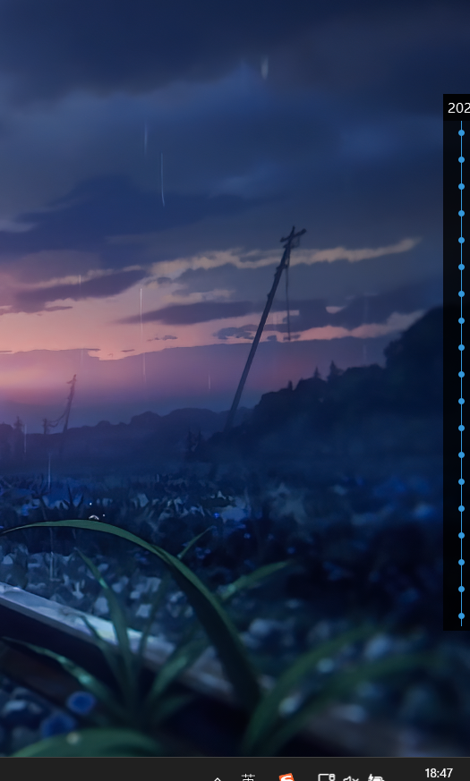

# Live2D Desktop Mascot

# 新增设置窗口

效果图如下  

  

可以通过模型设置修改模型的文本，动作，和语音


***

## 开发环境
* Visual Studio 2022
* [Cubism Live2D SDK for Native]
* Qt5
* [jsoncpp]  
* [cpp-httplib]
* Hiyori的语音借助[ACGTTS]项目生成

[cpp-httplib]:https://github.com/yhirose/cpp-httplib
[jsoncpp]:https://github.com/open-source-parsers/jsoncpp
[Cubism Live2D SDK for Native]:https://www.live2d.com/download/cubism-sdk/

[ACGTTS]:https://github.com/chinoll/ACGTTS
  
以Cubism官方的OpenGL版Sample为模板，参考Live2D结合Qt的两篇文章进行的修改
https://zhuanlan.zhihu.com/p/126276925  
https://zhuanlan.zhihu.com/p/511077879  

## 功能介绍
1. 番剧列表  
   * 功能<del>参考</del>[贴吧]  
   * 双击打开番剧介绍页面
   * 每周一更新一次
   * 番剧列表储存在 bangumi.2023XXX.json 中，番剧源是[bangumi]  
   * 展示  
  
番剧列表，全部展开  

<div align="center">
	
</div>   

顶部隐藏  

  


侧边隐藏

<div align="center">
	
</div>  


1. 节日提醒
   * 一年更新一次，节日当天运行会有提示
   * 节日列表源是[免费节日api]
  
2. 基于茉莉云的ai聊天  
   * 右键双击打开聊天输入板，回车提交输入，左键双击聊天板取消并关闭
   * api来自[茉莉云]
   * 可行注册茉莉云账号，创建机器人，并在config.json中修改api-key和api-secret
   * 展示  

<div align="center">
	
	
</div>  

AI可以在茉莉云上进行调教，普通用户每日500次访问，一般来说是够了


3. 语音播放
   * 语音播放需要在model3.json文件中添加motion的Sound属性
   * 仅支持.wav格式，详细参数参考[Cubism Live2D SDK for Native]的口型同步
   * 语音和口型同步只支持**单声道**的.wav格式  
  
4. 文本显示  
   * 文本显示需要在model3.json文件中添加motion的Text属性
   * 需要自己修改模型的model3.json文件，详细参考Hiyori的模型  
  
5. 自定义  
   **可定义的交互动作组在.model3.json文件中**  

	| 动作组可用字段 | 字段含义 |  
	| - | - |  
	| Morning | 0-12点启动问候语 |
	| Afternoon | 12-18点启动问候语 |  
	| Evening | 18-22点启动问候语 |  
	| Midnight | 22-24点启动问候语 |
	| LongSittingTip | 运行时间满1h休息提示 |
	| Idle | 闲置时自动播放 |
	| TapHead | 点击头部触发语音 |
	| TapBody | 点击身体触发语音 |
	| TapSpecial | 特触（参考碧蓝航线） |  

	示例：
	```json
	{
		"Idle": [  //动作组Idle，播放时会从动作组中随机出一个动作

				{
					"File": "motions/Hiyori_m04.motion3.json",
					"FadeInTime": 0.5,
					"FadeOutTime": 0.5,
					"Sound": "sounds/Hiyori.jp.9.wav",
					"Text": "好吃的？Hiyori也想尝尝看呢！"
				},
				{
					"File": "motions/Hiyori_m05.motion3.json",  //动作路径
					"Sound": "sounds/Hiyori.jp.1.wav",  //音频文件路径
					"FadeInTime": 0.5,
					"FadeOutTime": 0.5,
					"Text": "是在学习吗，要加油啊！"  //语音文本
				}
		]
	}
	```
  
6. **更换模型，可以修改config.json的ModelName字段，引入其他模型请确保moc3模型格式**  
   

[贴吧]:https://tieba.baidu.com/p/5377537423
[bangumi]:https://bgm.tv
[免费节日api]:https://timor.tech/api/holiday
[茉莉云]:https://mlyai.com  


7. **系统托盘**  

<div align="center">
	  
</div>

***  

## 使用说明  

**已通过的测试运行环境：windows 10及以上，32位或64位系统**

**文件包括Resources文件夹，platform文件夹，qt动态库dll，三个visual c++动态库dll，两个exe可执行文件，32位版本还有ssl的两个动态库**  

**文件结构**  

1. **Resources文件夹放置moc3模型文件夹**  
一个标准moc3模型文件夹至少包含如下文件：  

    XXX为模型文件夹名称
   * XXX.model3.json - 模型配置文件
   * XXX.moc3 -  moc3模型
   * textures - 材质文件夹，内存放材质图片  

    可选:  
    *  motions - 动作文件 motion_name.motion3.json 存放的文件夹
    *  sounds - 语音文件 audio_name.wav 存放的文件夹  
  

2. **platform，Qt5Widgets.lib，Qt5Core.lib，Qt5Gui.lib为Qt运行需要的依赖，vcruntime140.dll，msvcp140.dll，msvp140_1.dll为visual c++所需依赖（无需额外安装visual c++，有visual c++环境的系统可以不需要）**  
   
3. **Demo-x86.exe，Demo-x64.exe 为主程序，运行时无命令窗口；Demo-x86-debug.exe，Demo-x64-debug.exe是程序的debug版本，执行时会有命令窗口，程序的运行信息会在命令窗口中输出。**  
     
4. **程序运行正常退出会保存当前配置，配置储存在config.json文件中，可以自行修改对应字段，以下是config.json文件解析：**  

	```json
	{
		"UserSettings" : 
		{
			"BgmList" : //番剧列表设置
			{
				"LastPos" :  //上次关闭时在屏幕上的位置
				{
					"X" : 1508, 
					"Y" : -595
				}
			},
			"Dialog" : //语音文本显示框
			{
				"Height" : 120,  //高度
				"StyleSheet" : "font-size: 20px;border: 1px solid rgb(0, 0, 0);background-color: rgba(0, 0, 0, 200);padding: 10px;margin : 0;color: white;font-family: Comic Sans MS;",
				"Width" : 300,  //宽度
				"WordInterval" : 10  //逐字显示的速度，单位毫秒
			},
			"KeepQuiet" : true,  //是否保持免打扰，鼠标点击不受角色影响
			"Mlyai" : //茉莉云api设置，参考茉莉云开发文档
			{
				"APIKey" : "82wmm51s1bskwft3",
				"APISecret" : "o0vp8k7e"
			},
			"ModelDir" : "../Resources",  //模型文件所在文件夹
			"ModelName" : "Hiyori",  //模型文件夹名称，更换模型时修改该字段
			"MotionInterval" : 5,  //自动播放动作的间隔
			"MouseTrack" : true,  //鼠标追踪，角色看向鼠标位置
			"NoSound" : true,  //静音
			"NoteOutPath" : ".",  //茉莉云api的聊天记录存放文件夹
			"ShowBgmList" : true,  //是否显示番剧列表
			"ShowText" : false,  //是否显示语音文本
			"StayOnTop" : false,  //窗口保存置顶
			"TextFadeOutTime" : 4,  //文本显示持续时间
			"UserName" : "ArcueidBrunestud"  //当前用户名称，默认为系统用户名称
		},
		"WindowSettings" : 
		{
			"AppName" : "桃濑日和",
			"FPS" : 45,  //帧率，越高内存占用越高
			"Height" : 500,  //角色高度
			"IconPath" : "../Resources/sample-hiyori_movie.png",  //应用图标路径
			"LastPos" :   //角色上次退出时在屏幕的位置
			{
				"X" : 1556,
				"Y" : 536
			},
			"Width" : 300  //角色宽度
		}
	}
	```

5. **从网络上下载的其他moc3模型，直接导入动作文件导入可能报错，需要将motion3.json文件中的TotalPointCount和TotalSegmentCount参数重新计算并修改。修改方法可以参考我的[Live2DMotion3Repair]**  
    
6.   **其他配置请参考moc3模型和[Cubism Live2D SDK for Native]**  

[Cubism Live2D SDK for Native]:https://docs.live2d.com/zh-CHS/cubism-sdk-manual/top/
[Live2DMotion3Repair]:https://github.com/Arkueid/Live2DMotion3Repair