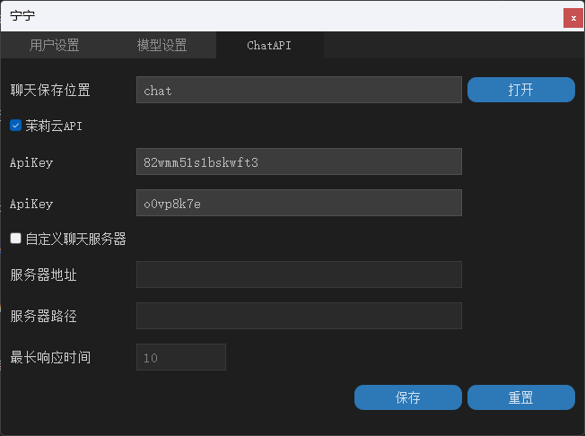
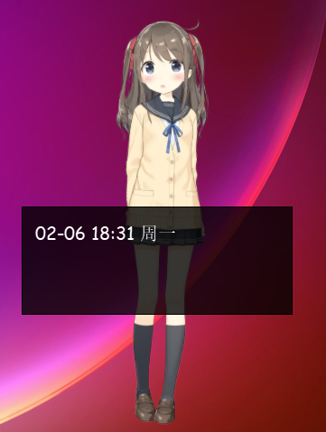

# Live2D Desktop Mascot

***

**中文** | **[English](README-en.md)**

## 开发环境
* Visual Studio 2022
* [Cubism Live2D SDK for Native]
* [Qt5](https://www.qt.io/download-qt-installer?hsCtaTracking=99d9dd4f-5681-48d2-b096-470725510d34%7C074ddad0-fdef-4e53-8aa8-5e8a876d6ab4)  
* [jsoncpp]  
* [cpp-httplib] + [openssl](https://slproweb.com/products/Win32OpenSSL.html)  
* 模型的语音借助[ACGTTS]生成  
* 
	以Cubism官方Native SDK为模板，结合以下两篇文章进行的修改：
	https://zhuanlan.zhihu.com/p/126276925  
	https://zhuanlan.zhihu.com/p/511077879 

[cpp-httplib]:https://github.com/yhirose/cpp-httplib
[jsoncpp]:https://github.com/open-source-parsers/jsoncpp
[Cubism Live2D SDK for Native]:https://www.live2d.com/download/cubism-sdk/

[ACGTTS]:https://github.com/chinoll/ACGTTS  


# 关于Cubism SDK的安全性问题 （2023-3-6）  


由于[Cubism SDK Core可能具有安全隐患](https://undeleted.ronsor.com/zh-cn/live2d-a-security-trainwreck/)，不怀好意的攻击者可能通过live2d模型来侵入使用者的设备，因此请谨慎使用本程序加载安全性未知或来源不明的模型。  


# ChangeLog
* 修复  
	* Win64下设置页面打开导致程序崩溃
	* 程序启动失败的问题  

		**可能原因1**  

		启动时获取当前系统用户名的代码运行错误，现已删除获取当前系统用户名，默认用户名固定为UserXXXX。  

		

		**已确认原因2**  

		Dialog初始化时未给_fontMetrics变量赋值，程序启动时分配的初始值不为NULL，在LoadConfig函数中导致用delete释放了一个未被分配的内存。<del>哼哼哼啊啊啊(#>д<)ﾉ</del>

		  


	* 番剧列表初次加载频闪问题（第二次修复） 
	* 网络请求模块无网络时导致程序崩溃 (第二次修复)

# 功能 

* 自定义聊天服务器接口（可在设置页面更改）
  
	**Request**  
	```http
	GET /chat?Text=聊天文本 HTTP/1.1
	Accept-Charset: UTF-8
	User-Agent: DesktopLive2D/v0.1.1
	```

	**Response  格式**

	**- Headers**
	```json
	{

		"Text": "返回文本",  //返回聊天文本，必须
		"...": "..."  //其他字段不做要求
	} 
	```

	**- Body**
	```
	bytes of XXX.wav  //音频数据，可无
	```

	配置

	* 在设置页面修改  


		

	* config.json中编辑以下字段

	```json

		"ChatAPI" : 
		{
			"ChatSavePath" : "chat",  //聊天音频和文本保存路径
			"CustomChatServer" : 
			{
				"HostPort" : "http://127.0.0.1:50721",  //服务器地址,http或https均可
				"On" : true,  //开启自定义聊天接口
				"ReadTimeOut" : 10,  //等待响应时间(秒)
				"Route" : "/chat"  //路径
			},
		}
	
	```

	服务端示例：

	```python
	@app.route("/chat", methods=["GET"])
	def chat():
		# 接收客户端的聊天文本
		text = request.args.get("Text", "")
		print("文本: %s" % text)

		# 构造响应
		rsp = make_response()

		# 响应头中添加Text字段
		rsp.headers.add_header("Text", "坐在电脑前很久了哦，快去休息一下吧！".encode("utf-8"))
		
		# 响应body中写入音频数据
		with open("serverFiles\\nn.longsittingtip_0.wav", "rb") as f:
			rsp.set_data(f.read())
		return rsp
	```

	动作组**Chat**，调用茉莉云或者自定义聊天接口时触发的动作。

	每次聊天都会在本地产生文本文件和音频文件（如有使用语音），注意及时清理。

* 自定义动作组与点击触发位置  


  参考 https://github.com/murcherful/Live2D_Displyer

  以下是上述项目关于自定义动作组和触发位置说明的引用  
  - 设置触发区域和相应动作组
  - 首先要了解`model3.json`中有关动作和触发区域的设定，以及文件的结构
    - 文件的结构大致为，模型文件可能不包含`Groups`和`HitAreas`，如果没有，请安以下规则填写，`Group`可无
      ```json
      {
      	"Version":3,
      	"FileReferences": {...},
      	"Groups": [...],
      	"HitAreas": [...]
      }
      ```
    - `FileReferences`的结构
      ```json
      "FileReferences": {
      	"Moc": ...,
      	"Textures": [...],
      	"Motions": {...},
      	...
      }
      ```
    - `Motions`的结构为，`path`为`yyy.motion3.json`与`xxx.model3.json`的相对路径
      ```json
      "Motions": {
      	"Idle":[
      		{"File": "path", "FeedINTime": 0.5, "FeedOutTime": 0.5},
      		{"File": "path", "FeedINTime": 0.5, "FeedOutTime": 0.5},
      		...
      	],
      	"TapBody":[
      		{"File": "path", "FeedINTime": 0.5, "FeedOutTime": 0.5},
      		{"File": "path", "FeedINTime": 0.5, "FeedOutTime": 0.5},
      		...
      	],
      	"TapArea1":[
      		{"File": "path", "FeedINTime": 0.5, "FeedOutTime": 0.5},
      		{"File": "path", "FeedINTime": 0.5, "FeedOutTime": 0.5},
      		...
      	],
      	...
      }
      ```
      `Motions`下的分组，比如`Idle`，`TapBody`，`TapArea1`等，表示鼠标点击至相应区域会触发的动作组，触发时，会随机一个动作组中的动作。注意，程序定义的分组标识有
      ```
      Idle
      TapBody
      TapArea1
      TapArea2
      TapArea3
      TapArea4
      TapArea5
      TapArea6
      TapArea7
      TapArea8
      TapArea9
      ```
      其中`Idle`为空闲时的动作组，其他为触发相应区域的动作组
    - `HitAreas`的结构为
      ```json
      "HitAreas": [
      	{"Name": "Body", "Id":"id"},
      	{"Name": "Area1", "Id":"id"},
      	{"Name": "Area2", "Id":"id"},
      	...
      ]
      ```
      其中`Name`为指定的区域名，程序定义的区域名有
      ```
      Body
      Area1
      Area2
      Area3
      Area4
      Area5
      Area6
      Area7
      Area8
      Area9
      ```
      这些区域与动作组的名称像对应
  - 了解了文件结构，想要设置相应的动作，首先要定义触发区域。而定义触发区域首先要知道模型区域的名字。这时：
    - 下载Live2D Cubsim3 Viewer，见[百度贴吧帖子](https://tieba.baidu.com/p/6066105365?red_tag=2138000797)或去[官网](https://www.live2d.com/download/cubism/)（注意直接下载**Cubism Editor**，不是**Cubism Viewer for Unity**）下载，下载安装后自动有Viewer，这个是免费的
    - 打开Viewer，将模型打开
    - 点击左上角的`xxx.moc3`，左下角出现信息
    - 将信息顶端的`Parameter`替换为`ArtMesh`
    - 点击相应的`ID`可以看见相应的区域变蓝
    - 选择你想要的区域，记下`ID`
    - 根据上面的介绍，将`id`替换为你记下`ID`，选择一个区域名，
    - 将区域名对应的动作组表示加入`Motions`中，并添加相应的动作
    - 保存模型，运行程序即可


* 番剧列表  
   * 功能<del>参考</del>[贴吧]  
   * 双击打开番剧介绍页面
   * 每周一更新一次
   * 番剧列表储存在 bangumi.2023XXX.json 中，番剧源是[bangumi]  
   * 展示  
	<br>

	<div align="center">
		
	</div>   

<div align="center"><b>番剧列表，全部展开 </b></div>
<br>
<br>


* 节日提醒
   * 一年更新一次，节日当天运行会有提示
   * 节日列表源是[免费节日api]
<br>
<br>
  
* 接入茉莉云的聊天机器人api  
   * 右键双击打开聊天输入板，回车提交输入，左键双击聊天板取消并关闭
   * api来自[茉莉云]
   * 可自行注册茉莉云账号，创建机器人，并在设置中修改key和secret
   * 展示  

<div align="center">
	
	<br>
	
</div>  

<div align="center">AI可以在茉莉云上进行调教，普通用户每日500次访问，一般来说是够了</div>
<br>
<br>

* 语音播放
   * 语音播放需要在model3.json文件中添加motion的Sound属性，或者通过设置页面修改
   * 仅支持.wav格式，详细参数参考[Cubism Live2D SDK for Native]的口型同步
   * 口型同步只支持**单声道**的.wav格式  
<br>
<br>

* 文本显示  
   * 文本显示需要在model3.json文件中添加motion的Text属性，也可直接在设置页面编辑
   * 需要自己修改模型的model3.json文件，详细参考Hiyori的模型  

[贴吧]:https://tieba.baidu.com/p/5377537423
[bangumi]:https://bgm.tv
[免费节日api]:https://timor.tech/api/holiday
[茉莉云]:https://mlyai.com  

<br>
<br>

* **系统托盘&右键菜单**  

	  
	<br>

	选项介绍： 

	|名称|介绍|
	|-|-|
	|番剧列表|显示或隐藏番剧列表|
	|鼠标追踪|开启后角色会看向鼠标|
	|背景穿透|除可交互的位置外，鼠标点击会透过窗体|
	|防遮挡|鼠标移动到窗口上时，角色窗口会变为透明，配合免打扰使用|
	|免打扰|任何鼠标点击事件不会受角色窗口影响|
	|显示背景|鼠标移动到窗口上会显示实际窗体|
	|置顶显示|绘制角色到屏幕最上方，不会受其他窗口影响|
	|静音|关闭语音播放|
	|显示文本|播放动作时同时显示语音的文本|
	|隐藏|最小化|


<br>
<br>

* **设置窗口**  

	效果图如下  

	  

	可以通过模型设置修改模型的文本，动作，动作组，和语音

	

	


	用户设置参数介绍：
	|名称|解释|
	|-|-|
	|应用名称|应用的名称，在系统托盘和设置标题栏上显示|
	|用户名称|默认为当前用户的名称，暂无用途|
	|托盘图标|任务栏图标，可使用自定义图片|
	|模型路径|模型存放的文件夹，默认为exe同路径下的Resources|
	|口型同步|口型同步的放大倍数，设置了单声道的wav音频时，会自动进行口型同步，口型同步不明显时可修改该参数，范围0-99|
	|动作频率|闲置时自动播放动作的间隔，单位秒，范围0-99|
	|FPS|帧率，越大消耗系统性能越多，建议在48左右，范围：1-99，不可为0|
	|窗口宽度|人物绘制的宽度，越大消耗系统性能越多，实际宽度请打开显示背景以确认|
	|窗口高度|人物绘制高度，同上|
	|Key|茉莉云聊天机器人api的key值，可前往官网免费注册|
	|Secret|茉莉云聊天机器人api的secret值，同上|  

	<br><br>

	模型设置介绍：  

	动作组  

	| 具有特定功能的动作组名称 | 字段含义 |  
	| - | - |  
	| Morning | 0-12点启动问候语 |
	| Afternoon | 12-18点启动问候语 |  
	| Evening | 18-22点启动问候语 |  
	| Midnight | 22-24点启动问候语 |
	| LongSittingTip | 运行时间满1h休息提示 |
	| Idle | 闲置时自动播放 |
	| TapHead | 点击头部触发语音 |
	| TapBody | 点击身体触发语音 |
	| TapSpecial | 特触（参考碧蓝航线） |  
	|  Chat   |调用聊天接口时触发的动作|

	选择动作后可在右边修改动作内容  

	**交互动作组保存.model3.json文件中，也可通过修改json文件实现自定义**  

	示例：
	```json
	{
		"Idle": [  //动作组Idle，播放时会从动作组中随机出一个动作

				{
					"File": "motions/Hiyori_m04.motion3.json",
					"FadeInTime": 0.5,
					"FadeOutTime": 0.5,
					"Sound": "sounds/Hiyori.jp.9.wav",
					"Text": "好吃的？Hiyori也想尝尝看呢！"
				},
				{
					"File": "motions/Hiyori_m05.motion3.json",  //动作路径
					"Sound": "sounds/Hiyori.jp.1.wav",  //音频文件路径
					"FadeInTime": 0.5,
					"FadeOutTime": 0.5,
					"Text": "是在学习吗，要加油啊！"  //语音文本
				}
		]
	}
	```

***  

## 注意事项

* 模型文件夹即Resources文件夹，其位置可更改，但至少有一个模型
  
  其内存放模型

  

* 音频和动作文件列表应放在对应模型的sounds和motions文件夹内，不能为其他位置  
  
  

* 音频文件只支持.wav格式，口型同步只支持单声道的.wav格式

* 程序错误无法启动时可删去config.json文件以初始化

* LPK模型需要解压为包含*.moc3, *.model3.json和纹理图片的文件夹形式


# 编译
在vs_project文件夹下，目前只整理了x86的项目，所有绝对路径已经改成相对路径，支持库也已经打包在vs_project\thirdParty文件夹下，应该可以做到开箱即用（maybe）

	用Visual Studio 2022 (建议VS 2022) 打开 			vs_project\proj_msvc2022_x86_mt\Demo.sln，有两个项目配置:  
	* Console -> Debug
	* Window -> Release  

1. 使用以下库静态库:  

	**Qt库**  
	* Qt5Widgets.lib  
	* Qt5Core.lib  
	* Qt5Gui.lib  
	* qtmain.lib  (子系统设置为窗口时需要)  

	**Windows系统**
	* Winmm.lib  
	
	**[Openssl]**
	* libssl.lib  
	* libcrypto.lib

[Openssl]:https://slproweb.com/products/Win32OpenSSL.html  

2. 引入头文件[\<httplib.h\>](https://github.com/yhirose/cpp-httplib)

3. 运行时需要的动态库:  

	**Qt运行环境**
	安装Qt后，使用Qt\bin下的windeployqt.exe 执行: 
	```shell
	windeployqt.exe "编译之后的程序.exe"
	```
	**Openssl (32位)**
	* libssl-3.dll  
	* libcrypto-3.dll  

  	**Openssl (64位)**
	* libssl-3-x64.dll  
	* libcrypto-3-x64.dll

	**对于没有Visual C++的环境需要额外安装或者将以下dll放在exe文件同目录下**

	* vcruntime140_1.dll 	**(x64)**
	* vcruntime140.dll 		**(x86/x64)**
	* msvcp140.dll 			**(x86/x64)**
	* msvcp140_1.dll 		**(x86/x64)**

以上步骤可能无法解决所有问题，需要自行查找方案.