# Live2D Desktop Mascot   

## [更新内容](CHANGELOG.md)
### 2023-08-07
***changes***
* 聊天记录使用 sqlite 储存
* 重新启动应用会加载当天的所有聊天记录
* 聊天记录现在可以以天为单位在历史记录窗口查询
* 拆分 UI 资源和模型资源文件夹，现在 UI 资源固定放置在 assets 文件夹下
* 源代码由 GBK 更改为 UTF-8
* 自定义文本聊天和语音聊天统一用 json 格式进行传输，请求类型为 POST，参见[自定义聊天服务器模板](dev-server/dev-server.py)

***fix***
* 历史记录中播放音频无效
* 自定义语音聊天开启后再次启动程序开启无效

### 已知问题
- 适用 Unity 的 Live2D 模型可以加载但可能出现图层错误（穿模？）
- Cubism 2.0 及以前版本的模型（.moc，.mnt）无法加载
- 背景透明问题[#12](https://github.com/Arkueid/DesktopLive2D/issues/12) 
- <del>在历史记录中显示语音识别的结果 [#5](https://github.com/Arkueid/DesktopLive2D/issues/5) </del>
#### 关于背景透明的问题[#12](https://github.com/Arkueid/DesktopLive2D/issues/12) 

目前成功解决的一个场景如下：

在旧电脑上使用官方镜像安装 Windows 10 家庭版，未升级显卡驱动前，启动程序出现纯黑背景，更换模型出现#12的问题。升级显卡驱动后，使用 **集成显卡** 运行程序，无论是启动还是更换模型，#12的问题没有出现。使用 **独立显卡** 运行程序，启动时没有出现背景透明问题，但是更换模型后仍然出现背景透明问题。

背景透明问题可能和显卡驱动版本、显卡类型（核显、独显）有关。

## 目录
- [工程文件](https://github.com/Arkueid/Live2DMascot/tree/develop)     
- [预览](#预览)
- [功能](#功能)  
	* [自定义聊天服务器接口](#自定义聊天服务器接口可在设置页面更改)
	* [自定义动作组](#自定义动作组与点击触发位置)
	* [节日提醒](#节日提醒)
	* [系统托盘](#系统托盘右键菜单)
	* [设置窗口](#设置窗口)
	* [语音播放](#语音播放)
	* [文本显示](#文本显示)  
- [注意事项](#注意事项)
- [开发环境](#开发环境)

## 预览  

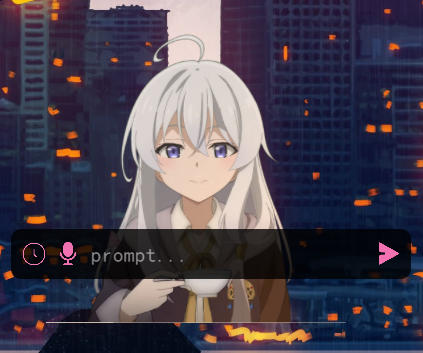

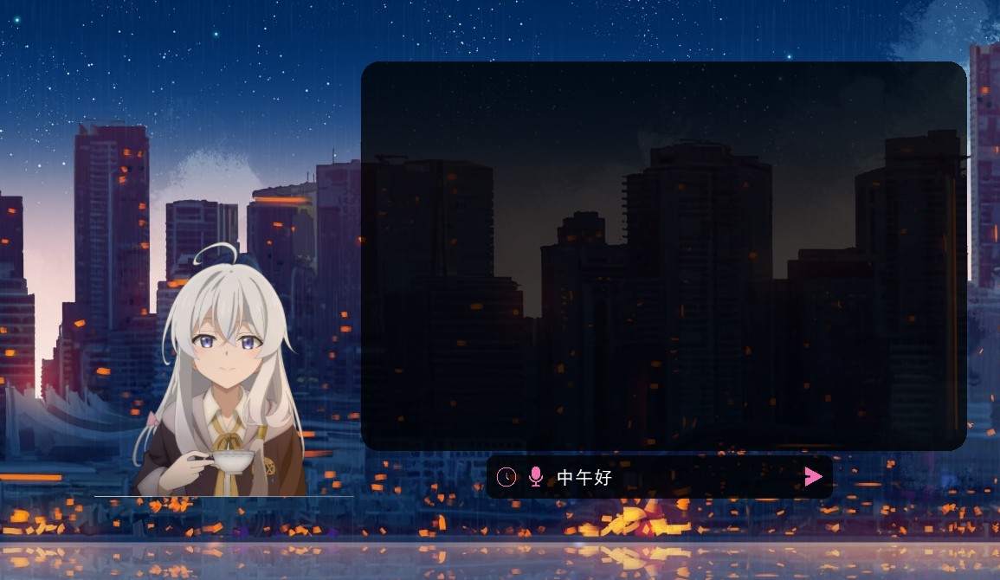

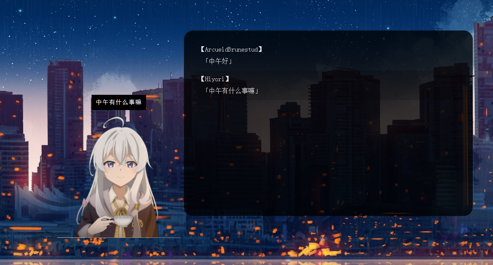

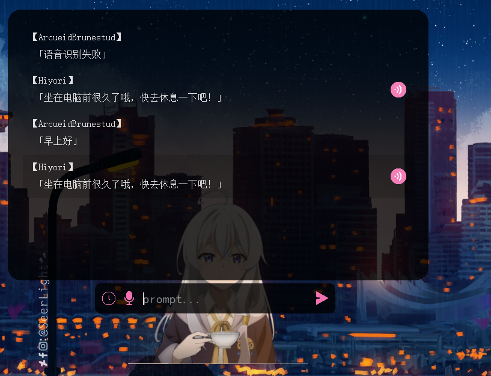 

Live2D 模型: [魔女之旅伊蕾娜：番剧画风live2d 活的！](https://www.bilibili.com/video/BV1KU4y1x7ep)  


## 功能 

* ### 自定义聊天服务器接口（可在设置页面更改）
  
	详细见[server模板](https://github.com/Arkueid/Live2DMascot/blob/develop/testserver/server.py)

	动作组**Chat**，调用茉莉云或者自定义聊天接口时触发的动作。

	每次聊天都会在本地产生文本文件和音频文件（如有使用语音），注意及时清理。

* ### 自定义动作组与点击触发位置  


  参考 https://github.com/murcherful/Live2D_Displyer


* ### 节日提醒
   * 一年更新一次，节日当天运行会有提示
   * 节日列表源是[免费节日api]
<br>
<br>
  
* 接入茉莉云的聊天机器人api  
   * 右键双击打开聊天输入板，回车提交输入，左键双击聊天板取消并关闭
   * api来自[茉莉云]
   * 可自行注册茉莉云账号，创建机器人，并在设置中修改key和secret
   * 展示  

<div align="center">
	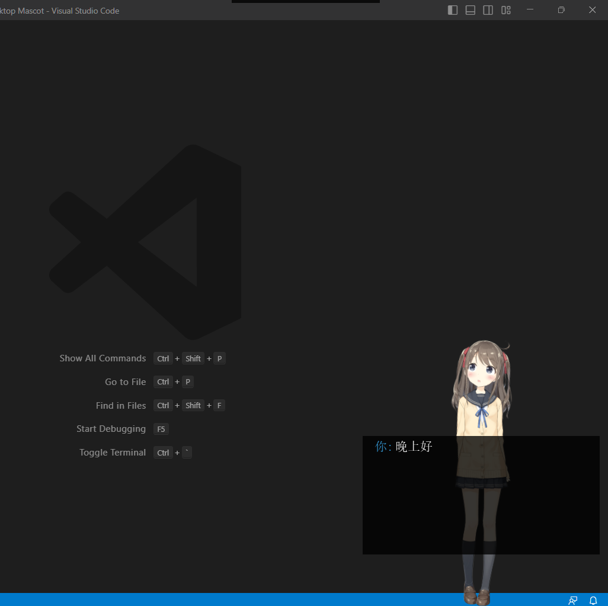
	<br>
	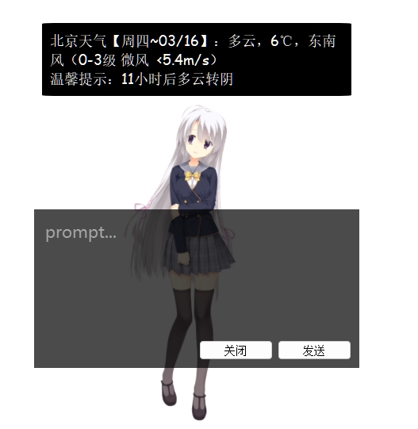
</div>  

<div align="center">AI可以在茉莉云上进行调教，普通用户每日500次访问，一般来说是够了</div>
<br>
<br>

* ### 语音播放
   * 语音播放需要在model3.json文件中添加motion的Sound属性，或者通过设置页面修改
   * 仅支持.wav格式，详细参数参考[Cubism Live2D SDK for Native]的口型同步
   * 口型同步只支持**单声道**的.wav格式  
<br>
<br>

* ### 文本显示  
   * 文本显示需要在model3.json文件中添加motion的Text属性，也可直接在设置页面编辑
   * 需要自己修改模型的model3.json文件，详细参考Hiyori的模型  

[贴吧]:https://tieba.baidu.com/p/5377537423
[bangumi]:https://bgm.tv
[免费节日api]:https://timor.tech/api/holiday
[茉莉云]:https://mlyai.com  

<br>
<br>

* ### **系统托盘&右键菜单**  

	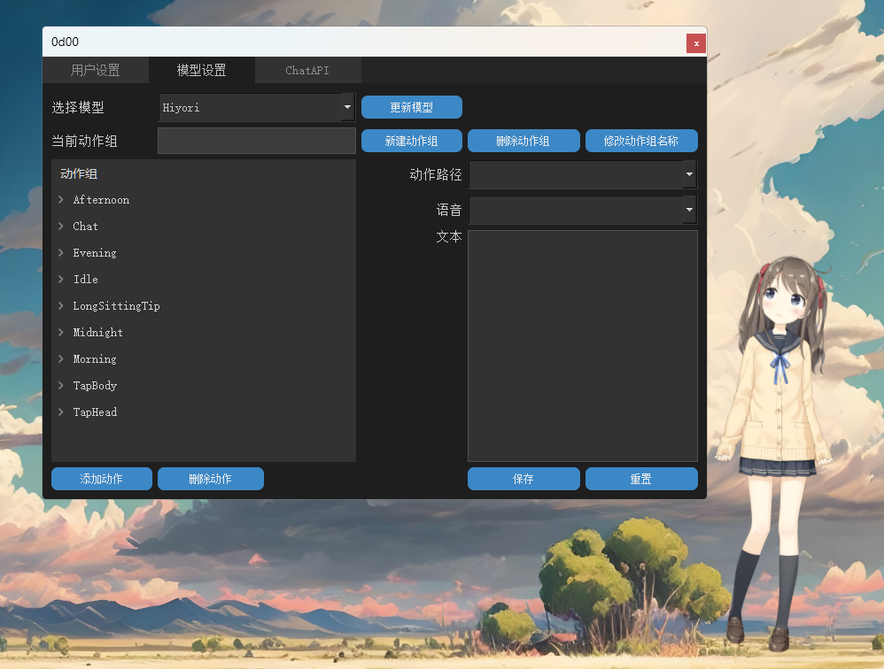  
	<br>

	选项介绍： 

	|名称|介绍|
	|-|-|
	|番剧列表|显示或隐藏番剧列表|
	|鼠标追踪|开启后角色会看向鼠标|
	|背景穿透|除可交互的位置外，鼠标点击会透过窗体|
	|防遮挡|鼠标移动到窗口上时，角色窗口会变为透明，配合免打扰使用|
	|免打扰|任何鼠标点击事件不会受角色窗口影响|
	|显示背景|鼠标移动到窗口上会显示实际窗体|
	|置顶显示|绘制角色到屏幕最上方，不会受其他窗口影响|
	|静音|关闭语音播放|
	|显示文本|播放动作时同时显示语音的文本|
	|隐藏|最小化|


<br>
<br>

* ### **设置窗口**  

	效果图如下  

	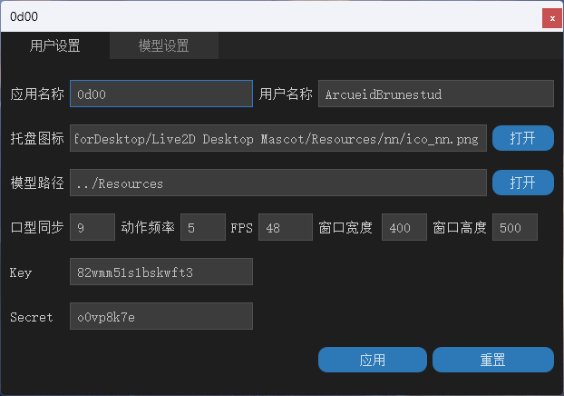  

	可以通过模型设置修改模型的文本，动作，动作组，和语音

	

	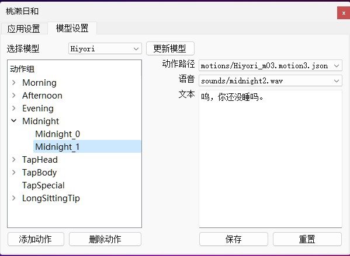


	用户设置参数介绍：
	|名称|解释|
	|-|-|
	|应用名称|应用的名称，在系统托盘和设置标题栏上显示|
	|用户名称|默认为当前用户的名称，暂无用途|
	|托盘图标|任务栏图标，可使用自定义图片|
	|模型路径|模型存放的文件夹，默认为exe同路径下的Resources|
	|口型同步|口型同步的放大倍数，设置了单声道的wav音频时，会自动进行口型同步，口型同步不明显时可修改该参数，范围0-99|
	|动作频率|闲置时自动播放动作的间隔，单位秒，范围0-99|
	|FPS|帧率，越大消耗系统性能越多，建议在48左右，范围：1-99，不可为0|
	|窗口宽度|人物绘制的宽度，越大消耗系统性能越多，实际宽度请打开显示背景以确认|
	|窗口高度|人物绘制高度，同上|
	|Key|茉莉云聊天机器人api的key值，可前往官网免费注册|
	|Secret|茉莉云聊天机器人api的secret值，同上|  

	<br><br>

	模型设置介绍：  

	动作组  

	| 具有特定功能的动作组名称 | 字段含义 |  
	| - | - |  
	| Morning | 0-12点启动问候语 |
	| Afternoon | 12-18点启动问候语 |  
	| Evening | 18-22点启动问候语 |  
	| Midnight | 22-24点启动问候语 |
	| LongSittingTip | 运行时间满1h休息提示 |
	| Idle | 闲置时自动播放 |
	| TapHead | 点击头部触发语音 |
	| TapBody | 点击身体触发语音 |
	| TapSpecial | 特触（参考碧蓝航线） |  
	|  Chat   |调用聊天接口时触发的动作|

	选择动作后可在右边修改动作内容  

	**交互动作组保存.model3.json文件中，也可通过修改json文件实现自定义**  

	示例：
	```json
	{
		"Idle": [  //动作组Idle，播放时会从动作组中随机出一个动作

				{
					"File": "motions/Hiyori_m04.motion3.json",
					"FadeInTime": 0.5,
					"FadeOutTime": 0.5,
					"Sound": "sounds/Hiyori.jp.9.wav",
					"Text": "好吃的？Hiyori也想尝尝看呢！"
				},
				{
					"File": "motions/Hiyori_m05.motion3.json",  //动作路径
					"Sound": "sounds/Hiyori.jp.1.wav",  //音频文件路径
					"FadeInTime": 0.5,
					"FadeOutTime": 0.5,
					"Text": "是在学习吗，要加油啊！"  //语音文本
				}
		]
	}
	```

***  

## 注意事项

* 模型文件夹即Resources文件夹，其位置可更改，但至少有一个模型
  
  其内存放模型

  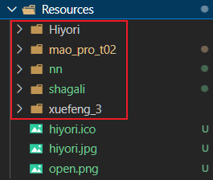

* 音频和动作文件列表应放在对应模型的sounds和motions文件夹内，不能为其他位置  
  
  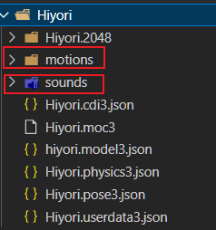

* 音频文件只支持.wav格式，口型同步只支持单声道的.wav格式

* 程序错误无法启动时可删去config.json文件以初始化

* LPK模型需要解压为包含*.moc3, *.model3.json和纹理图片的文件夹形式


## 开发环境
* Visual Studio 2022
* [Cubism Live2D SDK for Native]
* [Qt5](https://www.qt.io/download-qt-installer?hsCtaTracking=99d9dd4f-5681-48d2-b096-470725510d34%7C074ddad0-fdef-4e53-8aa8-5e8a876d6ab4)  
* [jsoncpp]  
* [cpp-httplib] + [openssl](https://slproweb.com/products/Win32OpenSSL.html)  
* 模型的语音借助[ACGTTS]生成  
* live2d模型来自:  
	* 碧蓝航线  
	* Cubism官方   
	* [再看一眼就会爆炸！波奇酱免费模型2.0](https://www.bilibili.com/video/BV1PY411k7Kj)  
	* [【虚拟主播模型】 宁宁vup化！](https://www.bilibili.com/video/BV1s7411d7y9)
* 
	以Cubism官方Native SDK为模板，结合以下两篇文章进行的修改：  
	https://zhuanlan.zhihu.com/p/126276925  
	https://zhuanlan.zhihu.com/p/511077879 

[cpp-httplib]:https://github.com/yhirose/cpp-httplib
[jsoncpp]:https://github.com/open-source-parsers/jsoncpp
[Cubism Live2D SDK for Native]:https://www.live2d.com/download/cubism-sdk/

[ACGTTS]:https://github.com/chinoll/ACGTTS  
