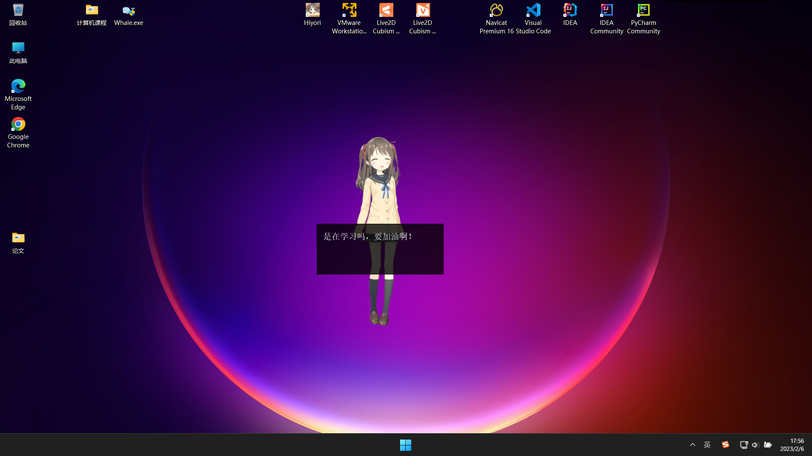

# Live2D Desktop Mascot   

## [更新内容](CHANGELOG.md)
### 2023-08-08
***changes***
* 设置窗口使用 Material 风格，组件来自：https://github.com/laserpants/qt-material-widgets

***fix***
* 修复模式的开启与关闭无法保存
* 源码改为 UTF-8 后导致含中文路径的模型资源加载崩溃，打开设置页面崩溃( v0.3.5 存在该问题)

## 预览  

## 功能 

* ### 自定义聊天服务器接口（可在设置页面更改）
  
	参考：[自定义聊天服务器模板](dev-server/dev-server.py)

	动作组 **Chat**，调用茉莉云或者自定义聊天接口时触发的动作。

	每次聊天都会在本地产生文本文件和音频缓存，注意及时清理。

* ### 自定义动作组与点击触发位置  

  参考：https://github.com/murcherful/Live2D_Displyer

## 注意事项

* 模型文件夹即Resources文件夹，其位置可更改，但至少有一个模型

* 音频和动作文件列表应放在对应模型的sounds和motions文件夹内，不能为其他位置  

* 音频文件只支持.wav格式，口型同步只支持单声道的.wav格式

* 程序错误无法启动时可删去config.json文件以初始化

* LPK模型需要解压为包含*.moc3, *.model3.json和纹理图片的文件夹形式

### 已知问题
- 适用 Unity 的 Live2D 模型可以加载但可能出现图层错误（穿模？）
- Cubism 2.0 及以前版本的模型（.moc，.mnt）无法加载
- 背景透明问题[#12](https://github.com/Arkueid/DesktopLive2D/issues/12) 
- <del>在历史记录中显示语音识别的结果 [#5](https://github.com/Arkueid/DesktopLive2D/issues/5) </del>
#### 关于背景透明的问题[#12](https://github.com/Arkueid/DesktopLive2D/issues/12) 

目前成功解决的一个场景如下：

在旧电脑上使用官方镜像安装 Windows 10 家庭版，未升级显卡驱动前，启动程序出现纯黑背景，更换模型出现#12的问题。升级显卡驱动后，使用 **集成显卡** 运行程序，无论是启动还是更换模型，#12的问题没有出现。使用 **独立显卡** 运行程序，启动时没有出现背景透明问题，但是更换模型后仍然出现背景透明问题。

背景透明问题可能和显卡驱动版本、显卡类型（核显、独显）有关。

## 开发环境
* Visual Studio 2022
* [Cubism Live2D SDK for Native]
* [Qt5](https://www.qt.io/download-qt-installer?hsCtaTracking=99d9dd4f-5681-48d2-b096-470725510d34%7C074ddad0-fdef-4e53-8aa8-5e8a876d6ab4)  
* [jsoncpp]  
* [cpp-httplib] + [openssl](https://slproweb.com/products/Win32OpenSSL.html)  
* [qt-material-widgets](https://github.com/laserpants/qt-material-widgets)
* [piemenu-qt](https://github.com/SimonBuxx/piemenu-qt)
* Hiyori，nn 的语音借助 [ACGTTS] 生成  
* Live2D 模型来源:  
	* xuefeng_3 -> 碧蓝航线  
	* Hiyori，Mao -> Cubism 官方   
	* 波奇酱2.0 -> [再看一眼就会爆炸！波奇酱免费模型2.0](https://www.bilibili.com/video/BV1PY411k7Kj)  
	* nn -> [【虚拟主播模型】 宁宁vup化！](https://www.bilibili.com/video/BV1s7411d7y9)
	* 爱 -> [传说级爱抖露点击就送【星野爱免费l2d】](https://www.bilibili.com/video/BV1g24y1F73e)
	* 星野爱，Hoshino_Ai -> [【星野爱免费live2d模型】重生之我在B站做虚拟爱抖露！星野爱永存！爱门！](https://www.bilibili.com/video/BV1Us4y1c7P4)
	* LSS -> [魔女之旅伊蕾娜：番剧画风live2d 活的！](https://www.bilibili.com/video/BV1KU4y1x7ep)  

* 
	以Cubism官方Native SDK为模板，结合以下两篇文章进行的修改：  
	https://zhuanlan.zhihu.com/p/126276925  
	https://zhuanlan.zhihu.com/p/511077879 

[cpp-httplib]:https://github.com/yhirose/cpp-httplib
[jsoncpp]:https://github.com/open-source-parsers/jsoncpp
[Cubism Live2D SDK for Native]:https://www.live2d.com/download/cubism-sdk/

[ACGTTS]:https://github.com/chinoll/ACGTTS  
