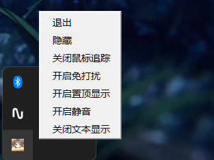
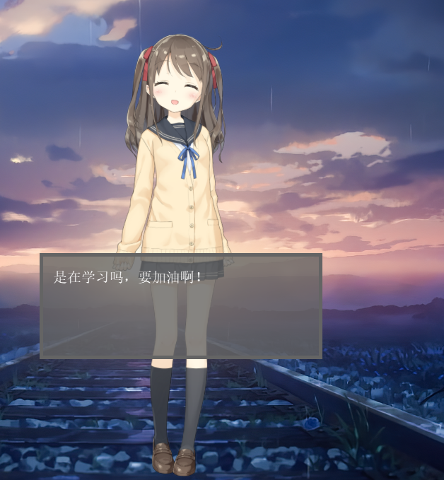
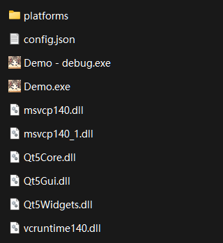

# Live2D Desktop Mascot

## 功能展示  

**任务栏图标**  
  


**桌宠效果**  
  


## 开发环境
* Visual Studio 2022
* Cubism Live2D SDK for Native
* Qt5
* jsoncpp  
* Hiyori的语音参考ACGTTS项目
  
以Cubism官方的OpenGL版Sample为模板，参考Live2D结合Qt的两篇文章进行的修改
https://zhuanlan.zhihu.com/p/126276925  
https://zhuanlan.zhihu.com/p/511077879  

***  

## 使用说明  

**测试运行环境：windows 10及以上，32位或64位系统**

**文件包括Resources文件夹，platform文件夹，三个qt动态库dll，三个visual c++动态库dll和两个exe可执行文件**  

**文件结构**  


1. **Resources文件夹放置moc3模型文件夹**  
一个标准moc3模型文件夹至少包含如下文件：  

    XXX为模型文件夹名称
   * XXX.model3.json - 模型配置文件
   * XXX.moc3 -  moc3模型
   * textures - 材质文件夹，内存放材质图片  

    可选:  
    *  motions - 动作文件 motion_name.motion3.json 存放的文件夹
    *  sounds - 语音文件 audio_name.wav 存放的文件夹  
  

2. **platform，Qt5Widgets.lib，Qt5Core.lib，Qt5Gui.lib为Qt运行需要的依赖，vcruntime140.dll，msvcp140.dll，msvp140_1.dll为visual c++所需依赖（无需额外安装visual c++，有visual c++环境的系统可以不需要）**  
   
3. **Live2D Desktop Mascot.exe 为主程序，运行时无命令窗口；Live2D Desktop Mascot - debug.exe是程序的debug版本，执行时会有命令窗口，程序的运行信息会在命令窗口中输出。**  
     
4. **程序运行正常退出会保存当前配置，配置储存在config.json文件中，可以自行修改对应字段，以下是config.json文件解析：**  

	```json
	{
		"UserSettings" : //用户设置
		{
			"Dialog" : 
			{
				"Height" : 150,  //文本框的高度
				"StyleSheet" :   //文本框样式，具体参考QSS
				"font-size: 20px;border: 5px solid rgb(100, 100, 100);background-color: rgba(100, 100, 100, 200);padding: 10px;margin : 0;color: white;font-family: Comic Sans MS;",
				"Width" : 400  //文本框的宽度
			},
			"KeepQuiet" : false,  //免打扰模式，鼠标点击可以穿透角色
			"ModelDir" : "Resources",  //模型所在文件夹
			"ModelName" : "Hiyori",  //Resources文件夹下的模型文件夹名称
			"MouseTrack" : true,  //鼠标追踪，人物会看向鼠标所在位置
			"NoSound" : false,  //静音模式
			"ShowText" : true,  //播放动作时显示文本框
			"StayOnTop" : false,  //窗口置顶
			"TextFadeOutTime" : 4  //文本消失时间
		},
		"WindowSettings" : 
		{
			"AppName" : "桃濑日和",  //程序名称
			"Height" : 700,  //绘制人物的画板高度
			"IconPath" : "./Resources/sample-hiyori_movie.png",  //图标路径
			"FPS": 45,  //显示帧率，默认60帧
			"LastPos" :   //上次正常关闭时人物在屏幕上的位置
			{
				"X" : 1398,  //x坐标
				"Y" : 239  //y坐标
			},
			"Width" : 500  //绘制人物的画板宽度
		}
	}
	```

5. **更换模型，可以修改ModelName字段，引入其他模型请确保moc3模型格式**  
   
6. **自定义角色文本，请在对应模型的XXX.model3.json文件中添加并修改Text字段**  

7. **自定义角色语音，请在对应模型的XXX.model3.json修改Sound字段，同时创建sounds文件夹并放入.wav格式音频文件**  
   
8. **可定义的交互动作组在.model3.json文件中**  

	| 动作组可用字段 | 字段含义 |  
	| - | - |  
	| Morning | 0-12点启动问候语 |
	| Afternoon | 12-18点启动问候语 |  
	| Evening | 18-22点启动问候语 |  
	| Midnight | 22-24点启动问候语 |
	| LongSittingTip | 运行时间满1h休息提示 |
	| Idle | 闲置时自动播放 |
	| TapHead | 点击头部触发语音 |
	| TapBody | 点击身体触发语音 |
	| TapSpecial | 特触（参考碧蓝航线） |

9. **从网络上下载的其他moc3模型，直接导入动作文件导入可能报错，需要将motion3.json文件中的TotalPointCount和TotalSegmentCount参数重新计算并修改**  
    
10.  **其他配置请参考moc3模型和Cubism Live2D SDK for Native**  